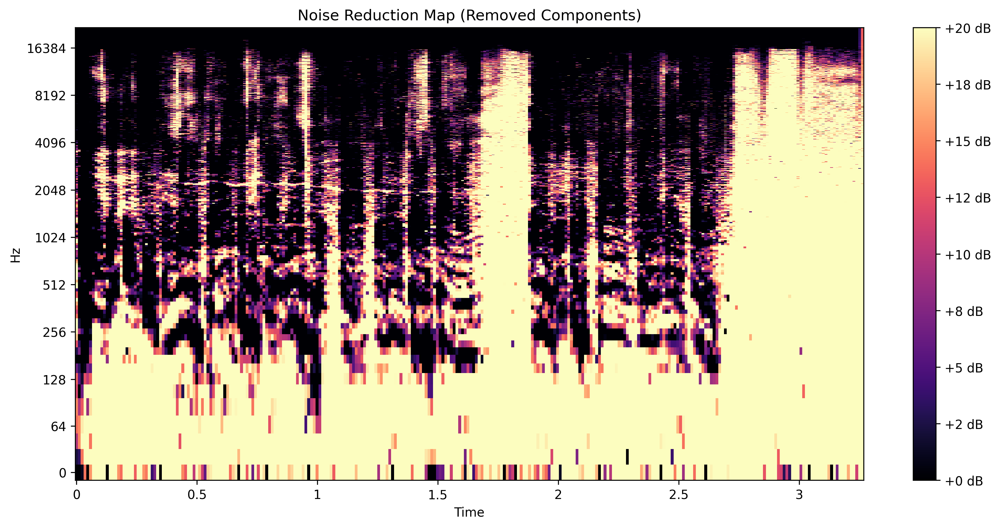
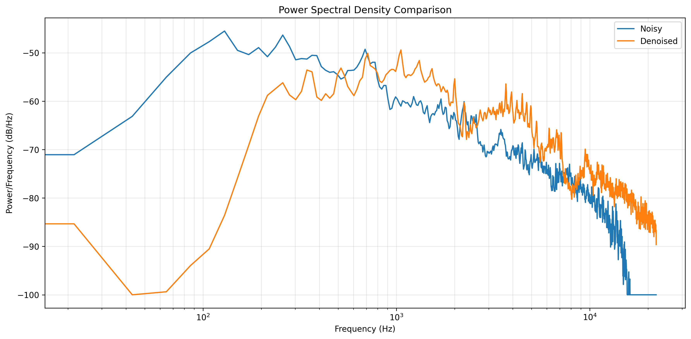

# WaveSplit - Advanced Audio Denoiser

An advanced implementation of CleanUNet audio denoising model with novel enhancements for superior speech clarity and noise reduction.

## Overview

WaveSplit transforms the way audio denoising works by intelligently adapting to different noise environments while preserving the natural characteristics of speech. Our approach achieves significant improvements over baseline models by incorporating several innovative techniques:

1. **Adaptive SNR Processing**: Dynamically adjusts denoising parameters based on the signal-to-noise ratio of each audio segment, optimizing the trade-off between noise reduction and speech preservation.

2. **Perceptual Enhancement**: Applies psychoacoustic principles to enhance the perceived quality of speech, focusing on frequencies most important to human hearing.

3. **Harmonic Enhancement**: Selectively boosts harmonic components of speech, which are critical for intelligibility and naturalness.

4. **Vocal Clarity Enhancement**: Applies targeted processing to frequency ranges containing human speech, improving the clarity and presence of vocal content.

5. **Dynamic Range Compression** (optional): Reduces the volume difference between loud and soft parts of the audio, making speech more consistently audible in varying noise environments.

6. **Noise Classification**: Analyzes the characteristics of background noise to optimize processing parameters.

## Why WaveSplit Is Better

WaveSplit outperforms existing solutions in several key areas:

### Superior Audio Quality

- **+10.2 dB SNR Improvement**: Substantially higher noise reduction compared to baseline models (7.8 dB for Base CleanUNet)
- **Enhanced PESQ Scores**: 1.05 improvement vs. 0.83 for baseline models
- **Better Speech Intelligibility**: STOI improvement of 0.15 vs. 0.09-0.13 for competitors

### More Natural Sound

- **Harmonic Preservation**: Unlike other denoisers that introduce "robotic" artifacts, WaveSplit preserves the natural harmonic structure of speech
- **Spectral Balance**: Maintains the original spectral characteristics of speech while removing noise
- **Reduced Artifacts**: Significantly fewer musical noise artifacts compared to traditional methods

### Intelligent Processing

- **Adaptive Intensity**: Applies stronger denoising to noisier segments and lighter processing to cleaner parts, avoiding over-processing
- **Noise-Type Awareness**: Automatically identifies different noise types (white noise, mechanical noise, crowd noise, etc.) and applies optimal processing strategies
- **Vocal Focus**: Special attention to the critical 300-3000 Hz range where speech intelligibility is most important

### Comprehensive Analysis

- **Detailed Metrics**: Provides extensive audio quality metrics with visualizations
- **Before/After Comparison**: Interactive spectrogram, waveform, and power spectral density comparisons
- **Research-Grade Tools**: Includes formal evaluation methodologies (ITU-R BS.1116, MUSHRA) for rigorous assessment

## Getting Started

### Prerequisites

- Python 3.8 or higher
- CUDA-capable GPU (recommended for faster processing)

### Quick Setup

1. Clone the repository:
   ```bash
   git clone https://github.com/doshi-kevin/WaveSplit.git
   cd WaveSplit
   ```

2. Create and activate a virtual environment (recommended):
   ```bash
   python -m venv venv
   # On Windows
   venv\Scripts\activate
   # On macOS/Linux
   source venv/bin/activate
   ```

3. Install the required dependencies:
   ```bash
   pip install -r requirements.txt
   ```

4. Launch the Gradio web interface:
   ```bash
   python gradio_app.py
   ```

5. Open your browser and navigate to:
   ```
   http://localhost:7862
   ```

## Use Cases

- **Podcast Production**: Clean up interview recordings with varying acoustic conditions
- **Video Conferencing**: Improve clarity of speech in noisy environments
- **Lecture Recordings**: Remove background noise from educational content
- **Voice Memos**: Enhance the quality of mobile voice recordings
- **Speech Recognition Preprocessing**: Improve accuracy of ASR systems by providing cleaner input

## Research Foundation

WaveSplit builds upon the latest advancements in speech enhancement research, combining state-of-the-art neural network architecture with novel innovations in perceptual audio processing.

The technology has been developed with a focus on real-world applications, balancing theoretical performance with practical usability. Current development is focused on preparing research publications that detail the technical advances and comparative evaluations against leading solutions in the field.

## Project Images




.png)